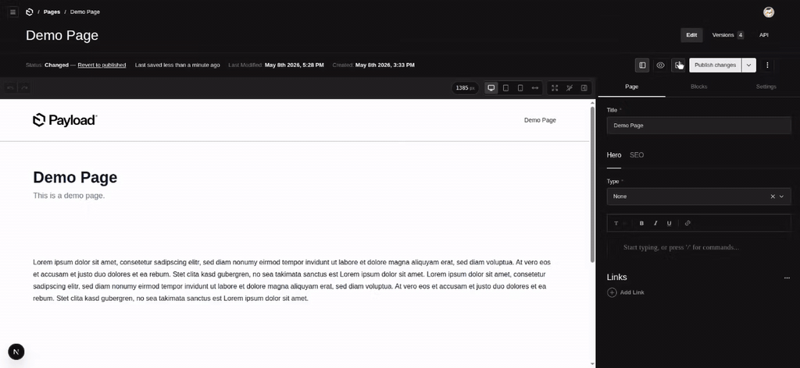
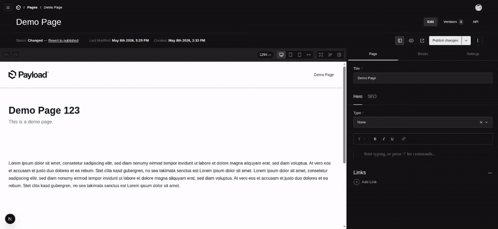
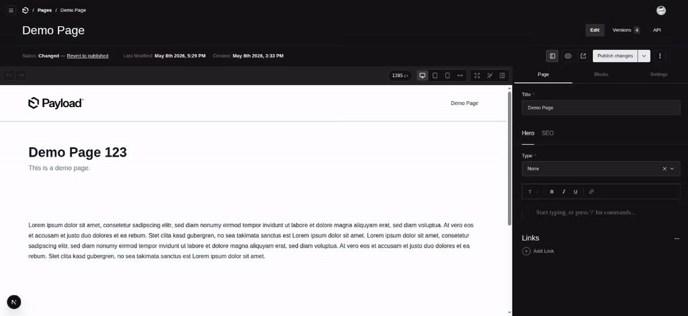

# payload-better-editor

[](https://www.npmjs.com/package/payload-better-editor)
[](https://www.npmjs.com/package/payload-better-editor)
[](https://github.com/scorpio-99/payload-better-editor)

Block editor plugin for [Payload CMS](https://payloadcms.com) that adds a side-by-side live-preview iframe and sidebar to the edit view. Hover any block in the preview to see it highlighted with a floating action toolbar (move, duplicate, add, delete); click it to open its fields in the sidebar. The sidebar mirrors your document's real tabs (page-level fields, the selected block's fields, and document settings) and renders everything with Payload's own field components, validations, and access control.

> **Found a bug?** Early-stage plugin, feedback is appreciated. [Open an issue](https://github.com/scorpio-99/payload-better-editor/issues/new) with steps to reproduce, your Payload version, and a minimal example. PRs welcome.

## Click any block to edit it

Open the editor from any document's edit view. The preview iframe loads your live frontend; clicking a block selects it and opens its real Payload fields in the sidebar - no schema duplication, no custom components.



## Features

- **Live preview iframe** with viewport switcher (Desktop, Tablet, Mobile, Responsive with drag handles) and an independent fullscreen toggle
- **Click-to-edit** any block at any nesting depth. The sidebar opens with the block's fields rendered via Payload's `RenderFields`, so custom field components, validations, and access control all just work
- **Floating in-iframe toolbar** on hover with move up, move down, duplicate, add-below, delete
- **Page, Blocks, Settings tabs** auto-derived from your document's tab structure
- **Undo and Redo** snapshot-based, with `Cmd/Ctrl+Z` and `Cmd/Ctrl+Shift+Z`
- **Interact mode** toggle so clicks pass through to forms, accordions, links inside the preview
- **Drag-resizable sidebar** with collapse toggle; width persisted to localStorage
- **Loading skeleton** in the iframe and an error boundary so a single bad block can't take the admin down

## Floating in-iframe toolbar

Hover any block in the preview to surface its floating action toolbar - move up, move down, duplicate, add-below, delete. All actions go through Payload's form state and are tracked by the plugin's undo/redo history.



## Viewports & layout controls

Switch between Desktop, Tablet, Mobile, and Responsive (drag-resizable). The fullscreen button is independent - it puts the whole editor (preview + sidebar) into fullscreen while the iframe keeps the viewport size you picked. The sidebar itself can be drag-resized to any width or collapsed entirely to give the preview the full canvas.



## Install

```bash
pnpm add payload-better-editor
```

See [DEVELOPERS.md](./DEVELOPERS.md) for setup, plugin options, runtime settings, and architecture notes.

## Requirements

- Payload `>=3.81.0`
- React 19

## Contributors

<a href="https://github.com/scorpio-99/payload-better-editor/graphs/contributors">
  
</a>
